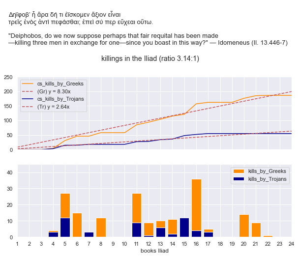

# Web App *Iliad*

The aim of this project is to create an educational Web App (React-Redux / Node) that gives both students and professional scholars of Homeric poetry easy access to the so-called "referential" quality of the poetry of the *Iliad*.1, 2

Current digital tools (e.g. [Perseus DL](http://www.perseus.tufts.edu/hopper/), [TLG](http://stephanus.tlg.uci.edu/), [Chicago Homer](https://homer.library.northwestern.edu/)) allow users to browse/search Homeric (and other) texts. However, they offer users only extremely limited access (if any) to basic metadata, such as simple facts about characters (e.g. "Greek" or "Trojan", "kleiner Kämpfer" or "*promakhos*"), events, the *Iliad*'s place in the larger Trojan Cycle (*Faktenkanon*), structural patterns in the poem, Indo-European *comparanda*. So on, and so forth.

In short, my aim is to create one place where the user can browse, search, and analyze the Iliadic text while having all such data readily (and visually) available. The user should be able to freely interact with filters, build his/her own analyses (e.g. dashboards, blogs on certain patterns) and be able to compare and share insights with others in the academic community.

All of this is very much "WiP" (*Work in Progress*).

1. Referential patterns denote narrative patterns that (seem to) exhibit 'traditional referentiality', defined by John Miles Foley as a deductive outgrowth of orality (1991, 6): "If traditional phraseology and narrative are conventional in structure, then they must also be conventional in their modes of generating meaning".

2. A more advanced private version of this repo contains much original research, which I do not wish to share publicly as yet. Of course, any interested party is very welcome to contact me in person to learn more!

## Contents

* [Data](#data)
* [Example WiP](#example-wip)
* [Examples of metadata](#examples-of-metadata)
* [Bibliography](#bibliography)
* [Contact](#contact)

### Data

The text of the *Iliad* is based on the edition of Monro/Allen, in the public domain, and sourced from the [Perseus repository](https://raw.githubusercontent.com/PerseusDL/canonical-greekLit/master/data/tlg0012/tlg001/tlg0012.tlg001.perseus-grc2.xml), but with a few minor emendations. The private version of the current repo uses the translation of Lattimore (see [Chicago Homer](https://homer.library.northwestern.edu/); not in the public domain).

The aim is to build an extensive DB, which contains among others:
- Iliadic text structured by sentence, word forms, lemmata, referential units, etc.
- Metadata on Iliadic characters (attributes), events, etc. linked to referential units.
- Personal collections of users.
- Public collections accepted for global access.
- WiP

### Example WiP

The gif below affords a brief look at the current state of the private repo (June 2022).

### Examples of metadata

1. *Statistic*. Homer uses an average ratio of 3.14:1 for Trojan deaths vs. Greek deaths. The user of the Web App should gain easy access to such an obvious structural pattern while investigating the text. E.g. in the form of a chart like below (see [repo](https://github.com/bobcorthals/iliad_killings)) with a *TL;DR* to ease processing of the (metalevel) implications of a certain part of the text where relevant. E.g. in *Il.* 13.446-7 (quoted below), a Greek (Idomeneus) mockingly explains to a Trojan (Deiphobos) the fairness of a 3:1 ratio. Such a comment contains a charged meaning for an audience that is aware of the poet's regular practice. 

2. *Referential pattern*. Homer variably refers to a shield as a *sakos* or an *aspis*. In a 2010 study, Natasha Bershadsky suggests an elegant solution to the difference in the employment of these terms. She shows that *sakos* and *aspis (pantos' eise)* do not point to any physical distinction (e.g. round vs. oblong shield), but rather connote various levels of protection and success in battle (2010, 18):
  
    >An application of these terms to a shield communicates the level of safety and the likelihood of victory that the shield-bearer has in a given episode: superior in the case of *sakos*, moderate in the case of *aspis pantos' eise*, and inferior in the case of *aspis*.

Again, the aim is to provide visual representations of such patterns whenever the user is analyzing a part of the text that uses one or more of these terms with a *TL;DR* explaining the applied logic.

The user should be able to find more elaborate explanations, with primary data etc. of such patterns in the section "Dashboards", *vel sim.*

### Bibliography

- Bershadsky, N. 2010. 'The Unbreakable Shield: Thematics of Sakos and Aspis', *CP* 150: 1–24.
- Foley, J. M. 1991. *Immanent Art: From Structure to Meaning in Traditional Oral Epic*. Bloomington, IN.
- Kelly, A. 2007a. *A Referential Commentary and Lexicon to Homer, Iliad VIII*. Oxford.

### Contact

This project was created by [@bobcorthals](https://github.com/bobcorthals). Feel free to reach out to me for any questions or comments.